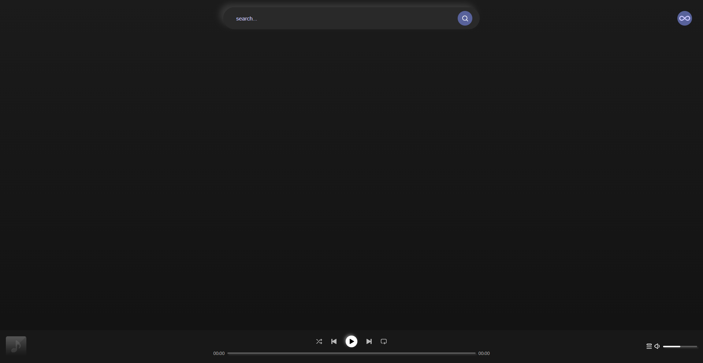
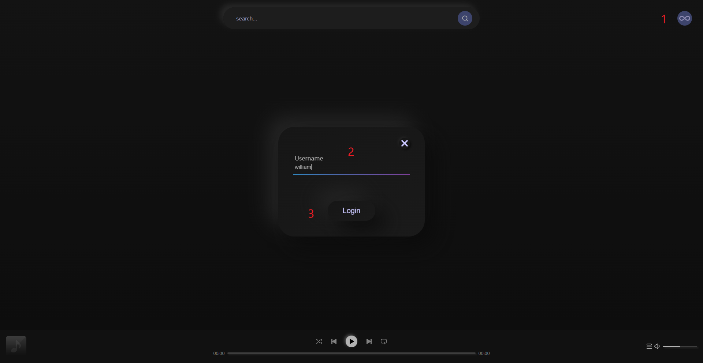

# 0. 项目结构 

```
/点歌台
├── app.js                # 服务器入口文件
├── package.json          # 项目配置文件
├── backend               # 后端文件夹
│   ├── app.js            # 入口文件
│   ├── config            # 配置文件夹
│   ├── controllers       # 控制器逻辑 主要用于反馈信息 状态码等
│   ├── models            # 用于存放直接操作数据的文件,与两个数据文件 
│   │   ├── data.json     # 歌曲列表与点歌用户的关系
│   │   └── user.json     # 用户信息
│   ├── NeteaseCloudMusicApi  # 网易云Node.js API
│   ├── public			  # 公用文件夹 保存公共变量
│   ├── routes			  # 路由处理
│   ├── services		  # 服务层，处理业务逻辑
|   ├── tasks			  # 定时任务文件夹
│   └── temp			  # 临时文件夹 下载的歌曲会放在这里
├── frontend			  # 前端文件夹 vue
│   ├── public			  # 公用文件夹 保存公共变量
│   ├── src			      # 源码文件夹
│   │    ├── assets		  # 公共资源文件
│   │    ├── components   # 组件文件夹
│   │    ├── plugins	  # 插件文件夹
|   |    ├── public       # 公用文件夹 保存公共变量 公共代码
|   |    ├── App.vue      # 前端主页文件
|   |    ├── main.js      # 前端主入口文件
|   |    ├── run.bat      # 启动前端脚本
|   |    ├── vue.config.js# vue配置文件
├── README.md 			
└── 需求文档.md
```

### 1. 项目概述

一个点歌平台，使同一宿舍的用户可以通过网页点播歌曲，并在服务器上播放。
本项目基于[NeteaseCloudMusicApi](https://github.com/Binaryify/NeteaseCloudMusicApi) 



### 2. 技术栈

- 前端：Vue.js、axios等。
- 后端：Node.js、Express框架等。
- 音频播放：VLC。

### 3. 运行环境

支持在Windows操作系统上运行
服务端需要安装 [VLC](https://www.videolan.org/) 并打开VLC的web功能

1. 工具> 偏好设置 > 左下角的显示设置 >全部> 界面>主界面>右侧勾选web
2. 接上一步 主界面的展开项 >Lua>LuaHttp>密码>输入密码并记住
3. 保存并重启vlc 

下载项目

```shell
git clone https://github.com/william-wwh/DormJukebox.git
cd DormJukebox
git submodule update --init
```

初始化及配置项目

1. 打开项目中的`backend\config\vlcConfig.js`,将密码改为,在第2步设置的密码
2. 进入项目`根目录`,`backend` ,`backend\NeteaseCloudMusicApi`,`frontend`目录下分别各执行一次 `npm install`
3. 打开`frontend\src\plugins\websocket.js`,将`ws://192.168.1.108:3000`改为`ws://<电脑的IP地址>:3000`
4. 打开`frontend\vue.config.js`,将`target: 'http://192.168.1.108:3000',`改为`target: 'http://<电脑的IP地址>:3000'`

### 4.运行项目

在终端中打开项目根目录 即在目录中可以查看到 backend 与 frontend文件夹

输入`npm start`在终端中即可查看项目运行的地址 在浏览器打开地址即可

在主页中间有搜索框 点击搜索建议自动填充到搜索栏
在主页右上角有登录按钮 在弹出的窗口中输入一个你喜欢的名字 这将是你的用户名



不需要密码 下次登录请再次输入用户名

#### 5.管理员权限

在`backend\models\user.json`中`admin`为`true`的就是管理员,管理员拥有下一曲, 删除列表中的歌曲的权力

若`user.json`不存在,那第一个注册的将会自动赋予管理员权限并创建`user.json`

#### 6.限制

点歌有5秒的频率限制 所有未登录的用户共用5秒 

###### 7.后话

这是学习后的一个练手项目 基于一个突发奇想 有空会慢慢完善 

git filter-branch --force --index-filter  'git rm --cached --ignore-unmatch -r node_modules'  --prune-empty --tag-name-filter cat -- --all
